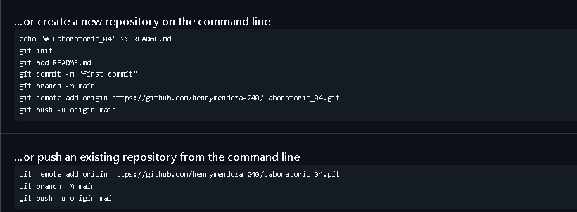

# Guia del Proyecto Laboratorio 03

Documentacion del trabajo colaborativo realizado en Git y GitHub.

## Requisitos previos

- Tener Git instalado en la computadora.
- Tener una cuenta activa en GitHub.

### Pasos de instalacion

1. Abrir la terminal del sistema.
2. Clonar el repositorio del laboratorio.
3. Entrar a la carpeta del proyecto.

## Control de tareas

- [x] Crear el repositorio remoto
- [x] Configurar las ramas de trabajo
- [ ] Resolver conflictos de codigo

## Resumen de comandos

| Comando         | Descripcion          |
| --------------- | -------------------- |
| git clone       | Descarga el proyecto |
| git checkout -b | Crea una nueva rama  |
| git merge       | Une dos ramas        |

## Ejemplo de uso

Para verificar la rama actual se usa `git branch`.

```bash
git checkout -b nueva-rama
git status
```

## Recursos e imagen

- [Documentacion oficial de Git](https://git-scm.com/doc)


